# PORTFOLIO

CLAY
-------------
[프로젝트 기간] 
2021-01 ~ 2021-04

[프로젝트 내용] 
유튜브 크리에이터를 위한 판매 스토어 앱

[CLAY 소개 페이지](https://criyou.com/)
[구글 플레이 스토어 바로가기](https://play.google.com/store/apps/details?id=com.criyou.clay)
[애플 스토어 바로가기](https://apps.apple.com/us/app/%ED%81%B4%EB%A0%88%EC%9D%B4/id1524293459)

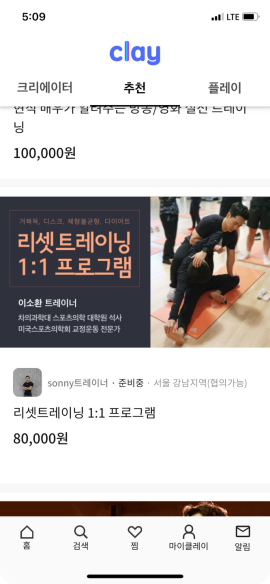
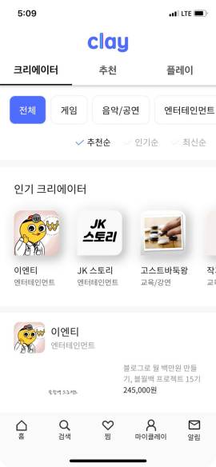

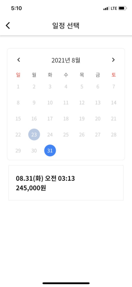
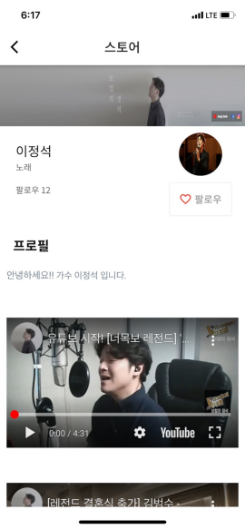
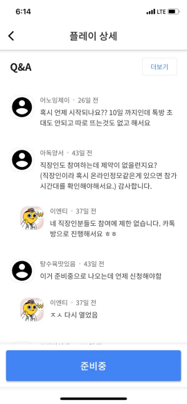

[프로젝트 인원] 안드로이드 2명

[본인 역할]
- Flutter, Dart, Provider
- 스플레시 화면, 메인화면, 상세화면, 프로필 화면, 필터 UI 개발 및 기능 구현
- 플랫폼(Android, iOS) 별 로그인, 권한 획득 기능
- firebase 환경 구축 및 연동

다모여커뮤니티
-------------
[프로젝트 기간]
2019-02 ~ 2019-03

[프로젝트 내용]
눈팅족들을 위한 각 커뮤니티 사이트의 인기, 베스트, 추천 게시글만 모은 앱

[구글 플레이 스토어 바로가기](http://bit.ly/2CFQEDF)

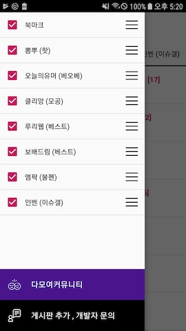
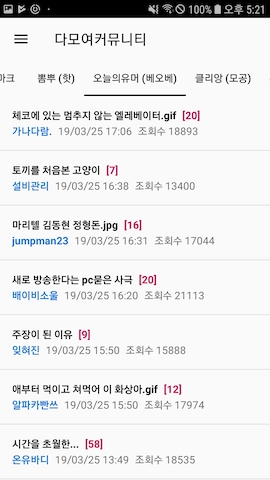
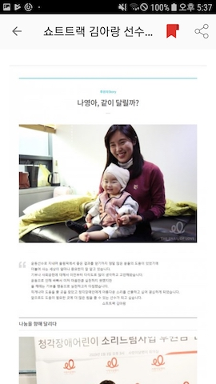

[프로젝트 인원]
안드로이드 1명

[본인 역할]
- Kotlin + MVVM + LiveData
- Pull to Refresh Layout Custom
- Jsoup을 이용한 커뮤니티 게시판 Parsing
- Drag & Drop 을 이용한 게시판 순서 조절
- 카카오 링크를 이용한 공유

구내식당앱
-------------
[프로젝트 기간]
2018-09-01 ~ 2019-01-01

[프로젝트 내용]
특정 지역 구내식당 리스트와 메뉴를 확인할 수 있는 앱.

[안드로이드 프로젝트 보기](https://github.com/pennya/GudiCafeteria)

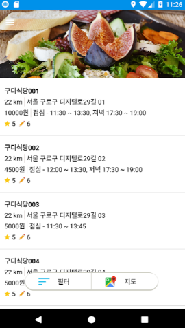
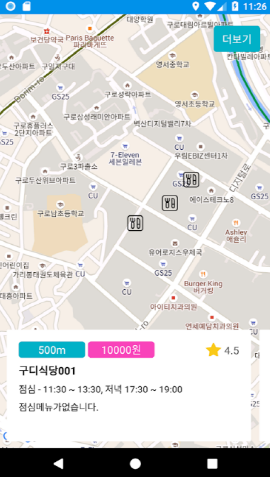
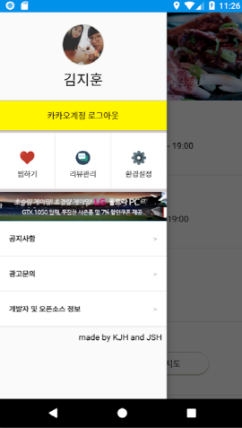
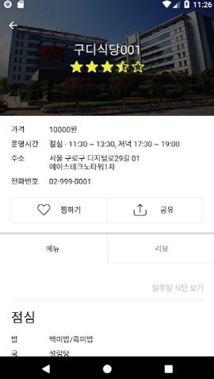
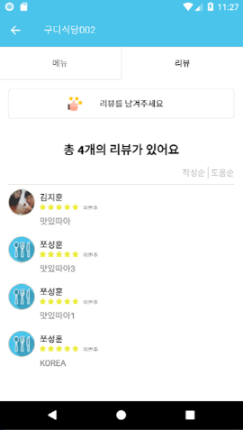
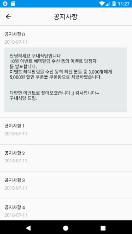

[프로젝트 인원]
안드로이드 1명, 백앤드 1명

[본인 역할]
- Kotlin + MVVM + LiveData + Reterofit2
- 식당 리스트 + 페이징 처리
- 구글 맵을 활용하여 식당 리스트 표현
- 식당 상세보기 Coornidator 적용 (배달의 민족 UI/UX 참고)
- 식당 리뷰 추가/삭제/수정
- 카카오 로그인 OAuth 2.0 적용
- 서버 연동

PackRiding
-------------
[프로젝트 기간]
2018-01-01 ~ 2018-04-30

[프로젝트 내용]
자전거 동호회을 위한 일정 생성, 참가, 확인 기능을 제공하는 애플리케이션 개발
로드 자전거를 구매하게 되었는데 여러 사람들과 함께 타기 위해 애플리케이션을 만들었습니다.
앱 스토어에 등록 후 라이딩 기록,  멤버 간 실시간 주행 위치 확인 기능 등을 추가할 예정입니다.

[구글 플레이 스토어 바로가기](http://bit.ly/2UTaN0h)

[Pack Riding 안드로이드 프로젝트 보기](https://github.com/pennya/ridecrew_client)

[Pack Riding 스프링부트 프로젝트 보기](https://github.com/pennya/spring_boot_ridecrew)

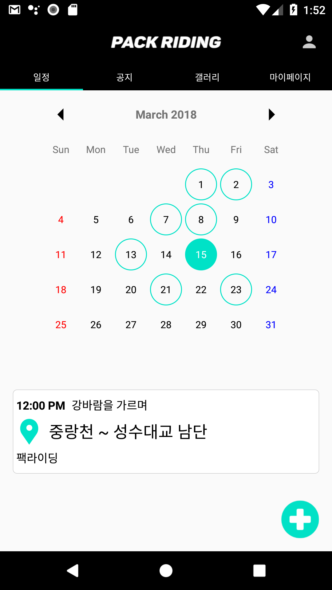
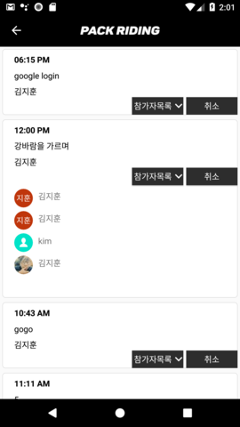
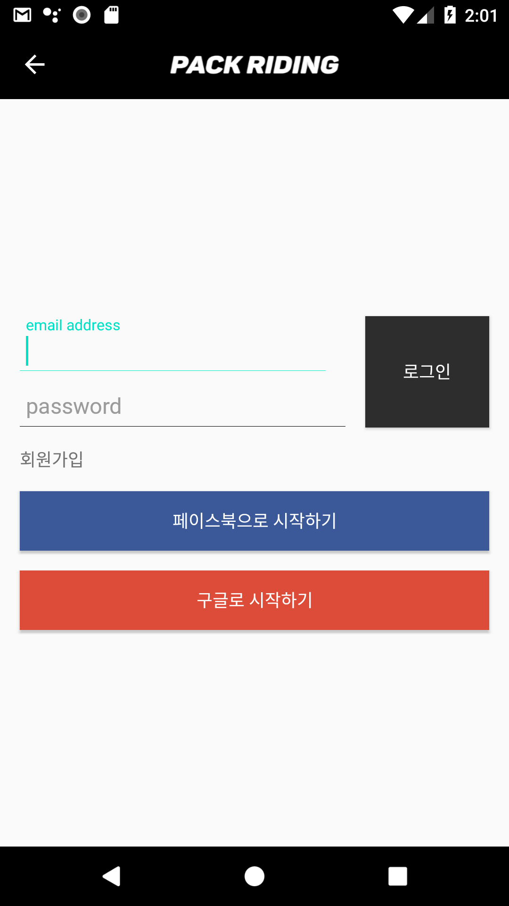
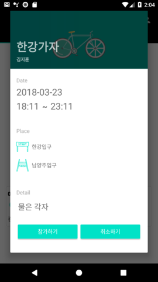

[프로젝트 인원]
안드로이드 개발자 총 2명

[본인 역할]
- MVP 패턴을 이용한 프로젝트 설계
- 일정 목록, 참가하기, 참가내역 기능 구현
- SNS 로그인 기능 구현 ( Google, Facebook 활용 )
- SpringBoot + JPA 를 활용한 REST API 개발 ( 회원가입, 로그인, 일정등록 등 CRUD 기능 구현 )
- AWS Elastic Beanstalk + S3 + RDS  프리티어 버전 세팅 및 웹서버 적용
- Git 을 이용한 코드 관리 ( git bash 활용 )

여기저기
-------------
[프로젝트 기간]
2017-07-01 ~ 2017-11-03

[프로젝트 내용]
출발지에서 목적지까지 국내 여행길의 관광정보를 제공하는 애플리케이션 개발
지정된 위치 반경으로 정보를 제공하는 애플리케이션들과는 차별성 있게 출발지부터 목적지 사이의 정보만 제공하는 애플리케이션을 만들었습니다.

[구글  스토어 바로가기](http://bit.ly/2YeKd3P)

[여기저기 안드로이드 프로젝트 보기](https://github.com/pennya/herethere)

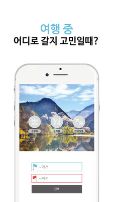
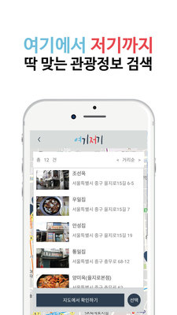
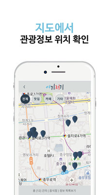
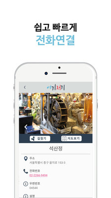

[프로젝트 인원]
팀 리더, 기획, 서버 개발자, 안드로이드(본인), IOS 개발자 총 5명

[주 사용 기술]
안드로이드

[본인 역할]
- MVP 패턴을 이용한 프로젝트 설계
- 지도, 마커, 자동완성검색 기능 구현 ( TMap API 활용 )
- 포털사이트와 연동하여 사용자간 리뷰 공유
- Retrofit 을 이용한 서버 데이터 Response
- Glide를 이용한 이미지 처리
- Git 을 이용한 코드 관리 ( git bash 활용 )
- Slack, Trello 를 이용한 협업 일정 관리

Sdcard DRM 솔루션 안드로이드 SDK 개발
-------------
[프로젝트 기간]
2017-07-01 ~ 2017-12-31

[프로젝트 인원]
팀장, 팀원(본인)  총 3명

[주 사용 기술]
안드로이드, NDK

[본인 역할]
- Sdcard Hidden 영역의 Secret Key 추출하는 API 구현
- 녹음 제어 기능 구현
- 블랙리스트 방식으로 녹화 프로세스 감지 기능 구현
- Dexguard를 이용한 SDK 난독화
- SDK, API 문서 작성

멀티미디어 DRM 솔루션 안드로이드 SDK 개발
-------------
[프로젝트 기간]
2016-07-01 ~ 2017-03-31

[프로젝트 내용]
멀티미디어 콘텐츠 저작권을 보호하기 위한 DRM 솔루션 안드로이드 SDK 개발
윈도우로 서비스하던 DRM 솔루션을 안드로이드로 포팅했으며 다운로드 및 스트리밍 기능을 구현

[주 사용 기술]
안드로이드

[프로젝트 인원]
팀장, 팀원(본인포함)  총 3명

[본인 역할]
- 로컬 저장소, 파일 서버의 콘텐츠를 오프라인에서 복호화 하기 위한 루프백 소켓 서버 개발
- 다운로드, 스트리밍 서비스(Progressive Download 방식) 구현
- 윈도우 버전에서 사용하던 암복호화 알고리즘 NDK로 포팅
- Dexguard를 이용한 SDK 난독화
- SDK, API 문서 작성

UWP 화면 보안 솔루션 개발
-------------
[프로젝트 기간]
2016-03-01 ~ 2017-04.30

[프로젝트 내용]
Windows 10 UWP 앱의 기밀정보와 컨텐츠의 불법 유출을 방지하는 PC 화면 캡쳐 방지 솔루션 개발
캡쳐 단축키, 화면 녹화 프로세스를 감지하여 클립보드를 차단하며 화면 워터마크를 기능으로 화면 촬영을 방지하는 기능입니다

[주 사용 기술]
C#, UWP Platform

[프로젝트 인원]
팀장, 기획, 팀원(본인) 총 3명

[본인 역할]
- 화면 캡쳐 방지 API 개발
- 가상 OS, 원격 터미털 탐지 및 차단하는 API 개발
- MVVM 아키텍처 패턴을 이용한 워터마크 개발
- 관리자 페이지 연동

PDF 문서 보안 DRM 솔루션 개발
-------------
[프로젝트 기간]
2016-06-01 ~ 2016-12.31

[프로젝트 내용]
전자 문서를 암호화하고 사용자 인증, 사용 권한을 제어하여 콘텐츠 내용 유출을 방지하는 문서 보안 솔루션 개발
사용자 PC 또는 특정 사용자만 파일을 열람할 수 있게 하거나, 일정 시간 동안만 접근할 수 있게 합니다.
클립보드 복사 방지, 사용자 메뉴 제어, 출력물 인쇄 차단, 캡쳐 방지, 워터마크 기능을 제공합니다.

[주 사용 기술]
C++/MFC

[프로젝트 인원]
팀장, 기획, 팀원(본인) 총 3명

[본인 역할]
- Adobe Reader, open source PDF viewer Hooking DLL 개발
- 클립보드 복사 방지, 프린트 인쇄 방지 기능 개발
- ActiveX 대체하기 위한 exe 설치 형 Non ActiveX 서비스 개발
- HTTPS SSL 인증서 적용
